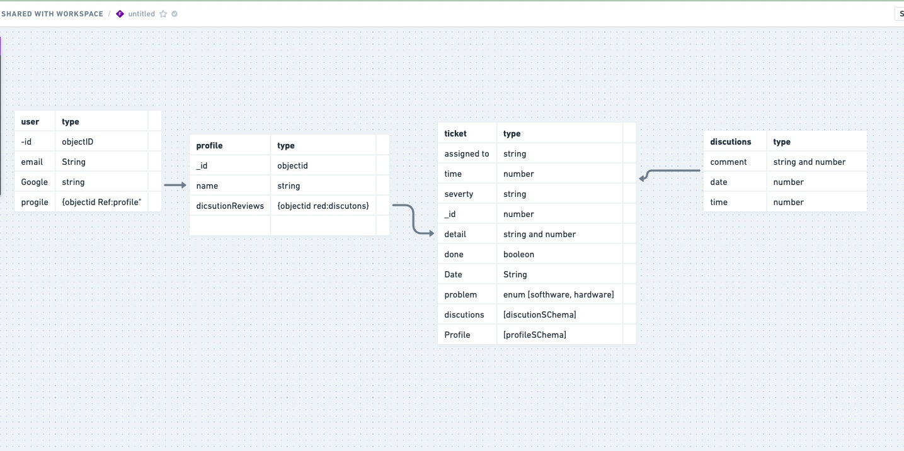
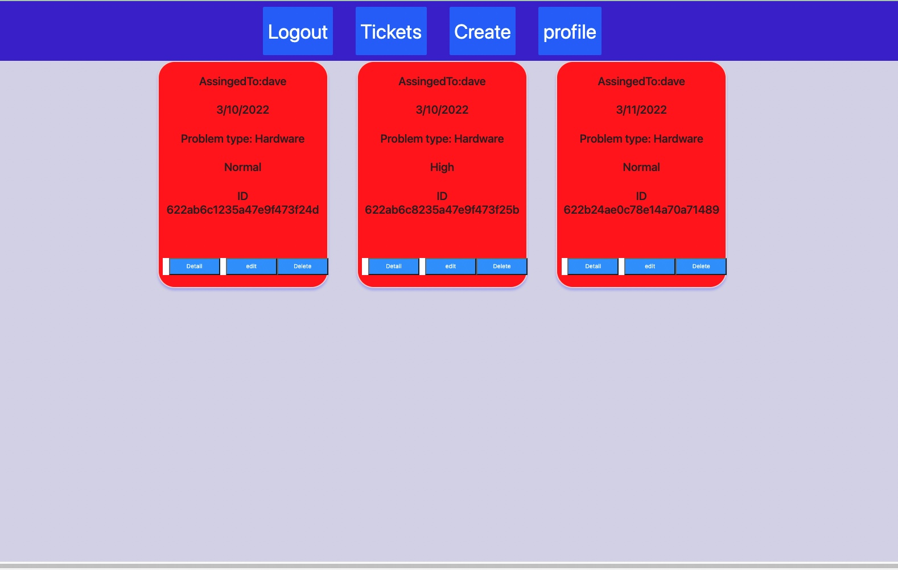

# Bug-Tracker

### What is a Bug-tracker?
A bug tracking system or defect tracking system is a software application that keeps track of reported software and hardware bugs 

Picture:
Picture:

[Bug Tracker](https://computer-tracker-bugs.herokuapp.com/)

## Technologies Used:
#### 1.HTML
#### 2.CSS
#### 3.JavaScript
#### 4.Heroku
#### 5. Express
#### 6. Node

# Future Plans
In the future I plan to add an Admin user and add profile page where the 
user can see all the tickets they've made 
